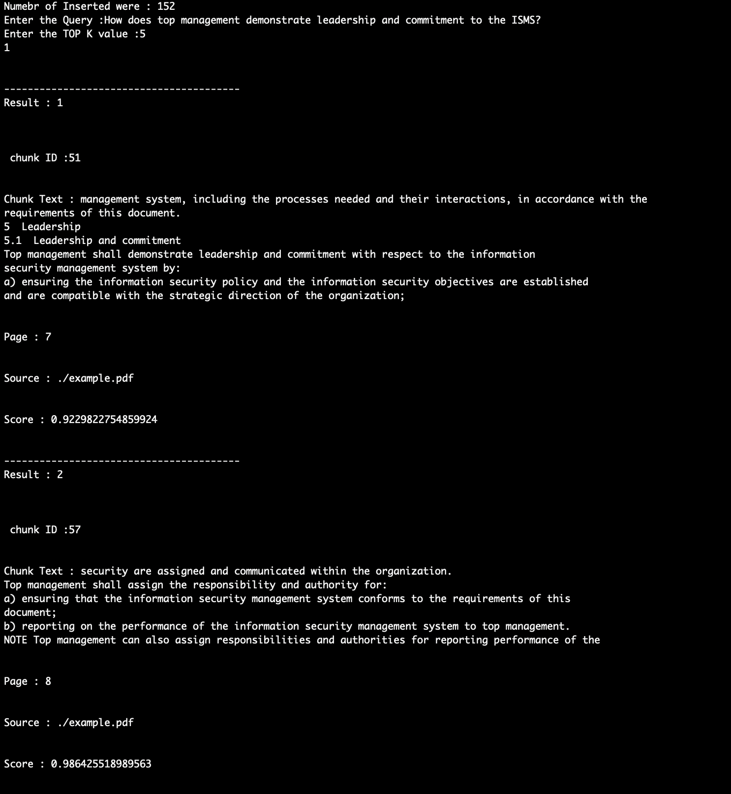
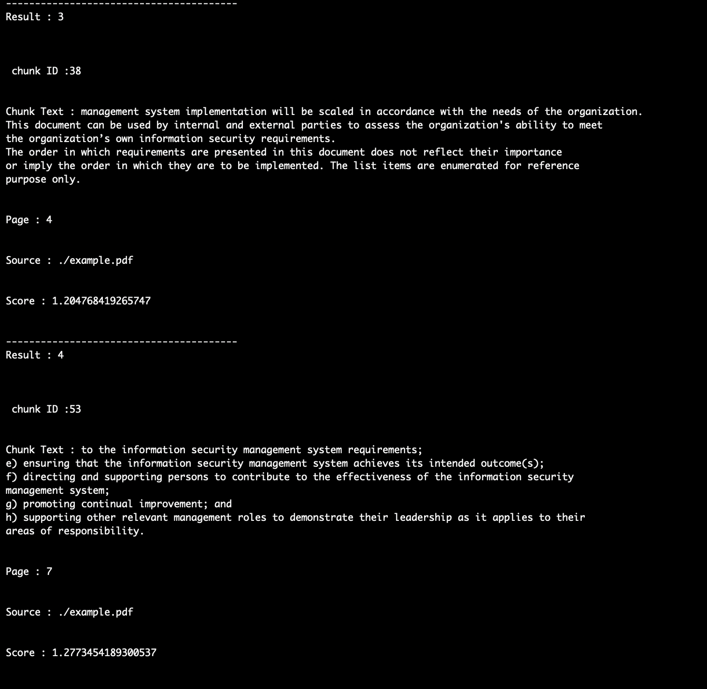
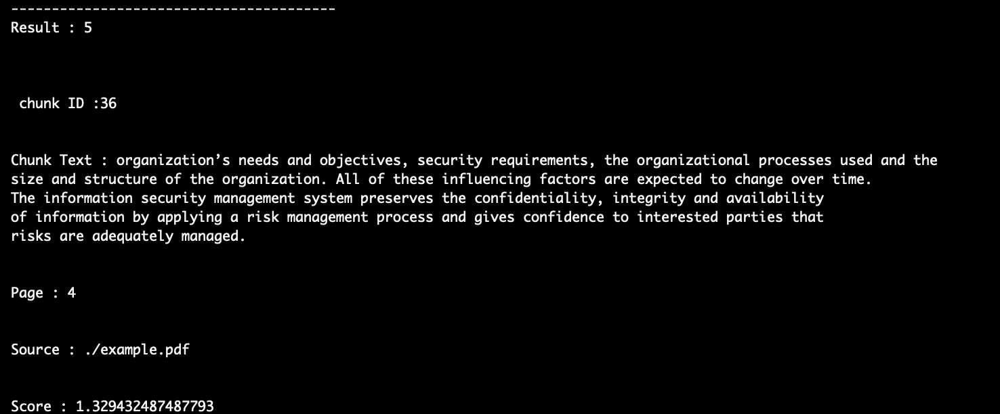
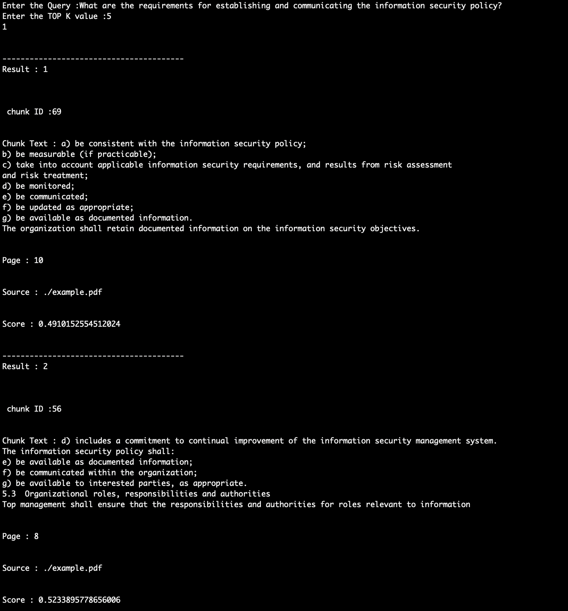
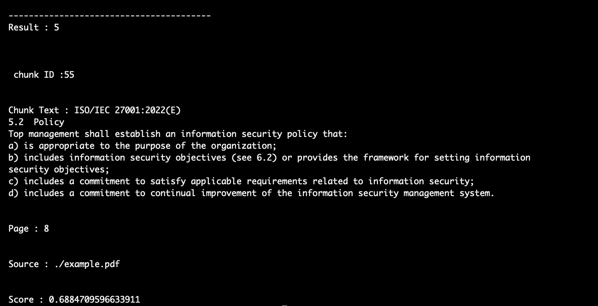
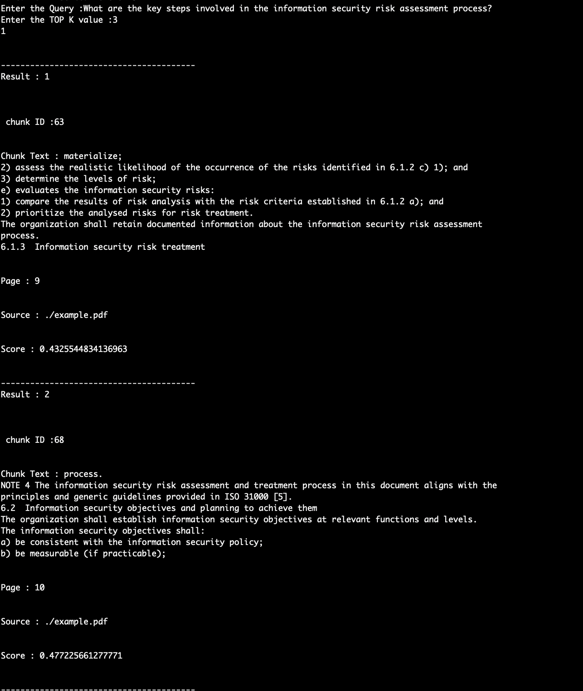

# Documentation for Chroma

**This code will run only on Python3.11**

**This code is not compatable with latest version of python 3.14**

**Steps to Run the Code**
* git clone https://github.com/adityasaicareer/celestial_systems_chroma.git
* cd celestial_systems_chroma
* pip install -r requirements.txt
* python rag_chroma.py

**Libraries Required**

```
from langchain_community.document_loaders import PyPDFLoader
from langchain_text_splitters import RecursiveCharacterTextSplitter
from langchain_huggingface import HuggingFaceEmbeddings
import chromadb
from chromadb.config import Settings
import re
import pprint
```

#### The Above Libraries were used in the code

* **langchain_community.document_loaders import PyPDFLoader** helps us toparse the PDF documents required for the context

* **langchain_text_splitters import RecursiveCharacterTextSplitter**. This will Help us to create Chunks from the parsed PDF document data

* **langchain_huggingface import HuggingFaceEmbeddings** helps us to use the **sentence-transformers/all-MiniLM-L6-v2** an Industry Standard to create the embedings

* **import chromadb**  This helps to inport the chromaDB library to create a local vectorDB 

* **chromadb.config import Settings** this will help us to manage the settings of the chromadb like the location of local DB


## Loading the PDF

```
filepath="./example.pdf"

loader=PyPDFLoader(filepath)
print(loader)

docs=loader.load()
```
 
 The Above code Demonstrates The loading of the PDF document using the Langchain Library PyPDFLoader

## Chunking the Document

```
text_splitter=RecursiveCharacterTextSplitter(chunk_size=500,chunk_overlap=100)

chunks=text_splitter.split_documents(docs)

for idx,chunk in enumerate(chunks):
  chunk.metadata["chunk_id"]=idx
```
From the Above code we use the RecursivecharacterTextSplitter for the chunking of the documents and each chunk has 500 characters as the information was largely in paragraph format and overlap of 100 to preserve the edge information

## Embeding of the Chunks

```
embedings=HuggingFaceEmbeddings(model_name="sentence-transformers/all-MiniLM-L6-v2")

texts=[chunk.page_content for chunk in chunks]
metadata=[chunk.metadata for chunk in chunks]
ids=[str(chunk.metadata["chunk_id"]) for chunk in chunks]

vectors=embedings.embed_documents(texts)
```
The Above code Snippets shows that we use the **sentence-transformers/all-MiniLM-L6-v2** transformer to create the embeding

we Destructure the chunk data into the texts, metadatas and ids for the better management of the data

and we generate the vectors using embeding.embed_documents(texts) function

## Chroma DB
```
client=chromadb.Client(Settings(persist_directory="./vectordb/chroma"))
collection=client.create_collection(name="my_collection")

vectors=embedings.embed_documents(texts)

collection.upsert(documents=texts,embeddings=vectors,metadatas=metadata,ids=ids)
```
* In the Above Code Snippet we create the client for the chromaDB which will act as an instance for chromadb 
* We create the Collection where the vectors will be stored
* Now we will insert all the data like texts,vectors and metadatas **collection.upsert(documents=texts,embeddings=vectors,metadatas=metadata,ids=ids)**

## Query

```
query="How does top management demonstrate leadership and commitment to the ISMS?"

query_vector=embedings.embed_query(query)

results=collection.query(
  query_embeddings=[query_vector],
  n_results=5
)
```
The above code snippet will represents the embeding of the query using embed_query and then use collection.query to search the database

## Outputs

### Sample Outputs

### Query 1: How does top management demonstrate leadership and commitment to the ISMS?
### TOP K=5






### Query 2: What are the requirements for establishing and communicating the information security policy?
### TOP K=5





### Query 3: What are the key steps involved in the information security risk assessment process?
### TOP K=3


